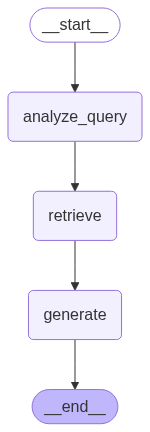
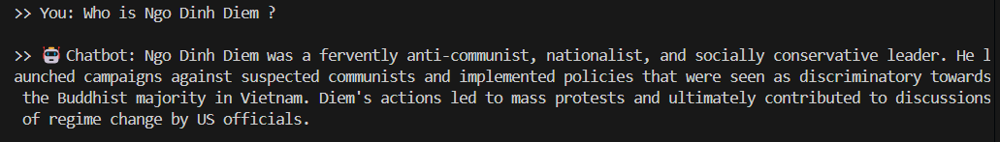

# Q&A Chatbot for Historical Documents using RAG and Google Gemini

A chatbot application that uses Retrieval-Augmented Generation (RAG) to answer questions based on the content of a PDF document.


## 1. Overview

This project is a chatbot application that utilizes the Retrieval-Augmented Generation (RAG) technique to enable users to ask questions and receive answers based on the content of a large PDF document. The primary purpose is to demonstrate how to build a complete RAG system from end to end using modern technologies such as LangChain, LangGraph, Google's Gemini models, and the FAISS Vector Store. It serves as a practical example for understanding the architecture and workflow of a RAG system, from data processing and embedding to final answer generation.

---

## 2. Specific Objectives

By exploring this project, you will be able to:
- Understand the architecture and workflow of a RAG system.
- Load and process text from a PDF file for data preparation.
- Use Google Generative AI to create text embeddings.
- Build, save, and load a vector store using FAISS.
- Construct a complex question-answering pipeline with LangGraph, including steps for query analysis, document retrieval, and answer generation.
- Create a simple command-line interface (CLI) chatbot to interact with the system.

---

## 3. System Architecture

The workflow of the RAG system is described as follows:

1.  **Load & Split**: The system loads a PDF document and splits it into smaller, manageable text chunks.
2.  **Embed & Store**: It uses an embedding model to convert these text chunks into vectors and stores them in a FAISS Vector Store.
3.  **User Question**: The user inputs a question.
4.  **Query Analysis**: An LLM analyzes the question to optimize the search query.
5.  **Retrieve**: The system searches for and retrieves the most relevant text chunks from the Vector Store (FAISS).
6.  **Generate**: The LLM receives the original question and the retrieved context to generate the final, comprehensive answer.

Workflow answers user questions like this:

<div align="center">
  
  <br>
  <strong><em>Figure 1: RAG System Processing Workflow</em></strong>
</div>

---

## 4. Technology Stack

-   **Language**: Python 3.9+
-   **Frameworks**: LangChain, LangGraph
-   **LLM & Embedding**: Google Generative AI (Gemini 2.0 Flash & Embedding-001)
-   **Vector Store**: FAISS (Facebook AI Similarity Search)
-   **Supporting Libraries**: PyPDF, python-dotenv, numpy

---

## 5. Usage

### 5.1. Prerequisites
-   Python 3.9 or higher
-   Git

### 5.2. Installation

1.  **Clone the repository to your local machine:**
    ```bash
    git clone https://github.com/phanminhtai23/VietnamWarQA-RAG.git
    cd VietnamWarQA-RAG
    ```

2.  **Install the required dependencies:**
    ```bash
    pip install -r requirements.txt
    ```

### 5.3. Configuration

1.  Create a file named `.env` (similar to `.example.env`) in the root directory of the project.
2.  Add your API Key from Google AI Studio (https://aistudio.google.com/app/apikey) to the `.env` file as follows:
    ```
    GOOGLE_API_KEY="YOUR_GOOGLE_API_KEY"
    ```

### 5.4. Running the Application

Run the `main.py` script to start the chatbot. The first time you run it, the system will automatically create a vector store from the `data/Vietnam_War.pdf` file.
```bash
python main.py
```
After initialization, you can start asking questions directly in your terminal like this:

<div align="center">
  
  <br>
  <strong><em>Figure 2: Chat example</em></strong>
</div>


## 6. Dataset

This project uses the `data/Vietnam_War.pdf` document as its knowledge base. It is a 28-page text document containing detailed information about the events, figures, and developments of the Vietnam War. The data is compiled from reputable sources (https://en.wikipedia.org/wiki/Vietnam_War) and includes source citations within the document itself. Vector documents are stored in `db\vector_store_faiss`.

---

## 7. Limitations

-   **Knowledge Scope**: The chatbot can only answer questions that fall within the scope of the content in the `Vietnam_War.pdf` file.
-   **Language**: The system is optimized for questions and content in English.
-   **Retrieval Quality**: The quality of the answers heavily depends on the retriever's ability to find the most relevant text passages.
-   **Speed**: The initial creation of the vector store may take some time, depending on the document's size.

---

## 8. Future Directions

-   Integrate more documents to expand the knowledge base.
-   Develop a web-based user interface (UI) instead of the current command-line interface.
-   Improve the retrieval algorithm with more advanced techniques like HyDE or RAG-Fusion.
-   Implement an automated evaluation of answer quality using frameworks like RAGAs.

---

## 9. License

This project is licensed under the MIT License. See the `LICENSE` file for more details.


## 10. Contact

For any questions or suggestions, please feel free to reach out:

-   **GitHub**: https://github.com/phanminhtai23
-   **Email**: phanminhtai23@gmail.com